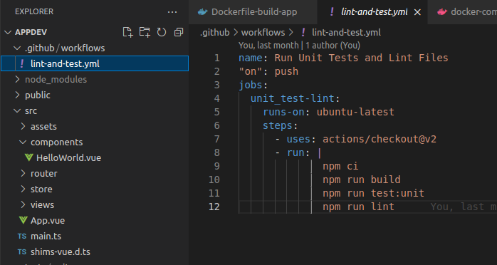

# tests+lint

Проект можно посмотреть в репозитории

[https://github.com/artemkholev/appDev](https://github.com/artemkholev/appDev)

Для начала нужно создать файлик lint-and-test.yml и заполнить 

Сделаем ошибку в форме написания кода, чтобы линтер показал на ошибку 

Сделаем намеренный коммит в репозиторий

Плучаем уведомление о не правельном формате 

Отработал правильно

Исправим ошибку и сделаем новый коммит

Проблемма решена