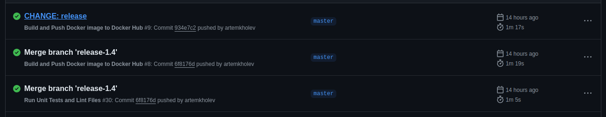

# release

Данную работу можно посмотреть в репозитории

[https://github.com/artemkholev/appDev](https://github.com/artemkholev/appDev/actions)



создадим файл yml 

```jsx
name: Create Release

on:
  push:
    branches: [master]
  pull_request:
    branches: [master]
    
jobs:
  build:
    runs-on: ubuntu-latest
    permissions:
      contents: write
      pull-requests: write
      repository-projects: write

    steps:
      - name: Checkout code
        uses: actions/checkout@v2

      - name: Set up Node.js
        uses: actions/setup-node@v3
        with:
          node-version: '16'

      - name: Install dependencies
        run: npm install

      - name: Build the project
        run: npm run build

      - name: Create binary
        run: |
          echo "Creating a binary file..."
          mkdir -p binaries
          echo "This is a binary file" > binaries/binaryfile.bin

      - name: Archive production artifacts
        run: |
          mkdir -p release
          zip -r release/release.zip dist/
        shell: bash

      - name: Verify release artifact
        run: ls -la release/

      - name: Create release
        id: create_release
        uses: actions/create-release@v1
        env:
          GITHUB_TOKEN: ${{ secrets.GITHUB_TOKEN }}
        with:
          tag_name: ${{ github.ref_name }}
          release_name: Release ${{ github.ref_name }}
          body: |
            Changes in this release:
            - List your changes here
          draft: false
          prerelease: false

      - name: Upload release assets (dist)
        uses: actions/upload-release-asset@v1
        env:
          GITHUB_TOKEN: ${{ secrets.GITHUB_TOKEN }}
        with:
          upload_url: ${{ steps.create_release.outputs.upload_url }}
          asset_path: ./release/release.zip
          asset_name: release.zip
          asset_content_type: application/zip

      - name: Upload release assets (binary)
        uses: actions/upload-release-asset@v1
        env:
          GITHUB_TOKEN: ${{ secrets.GITHUB_TOKEN }}
        with:
          upload_url: ${{ steps.create_release.outputs.upload_url }}
          asset_path: ./binaries/binaryfile.bin
          asset_name: binaryfile.bin
          asset_content_type: application/octet-stream
```


создаётся бинарник и сам исходный код.