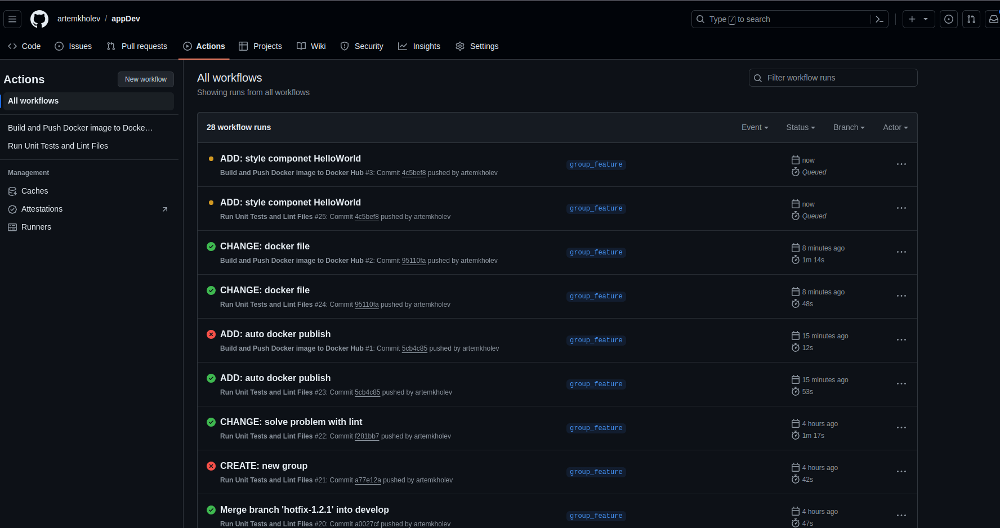

# auto dockerhub

Проект можно посмотреть в репозитории

[https://github.com/artemkholev/appDev](https://github.com/artemkholev/appDev)

Создадим файлик для автоматической загрузки на docker hub

```jsx
name: Build and Push Docker image to Docker Hub

on: push
jobs:
  push_to_registry:
    name: Push Docker image to Docker Hub
    runs-on: ubuntu-latest
    steps:
      - name: Check out the repo
        uses: actions/checkout@v3
      
      - name: Login to Docker Hub
        uses: docker/login-action@v2
        with:
          username: ${{ secrets.DOCKER_USER_NAME }}
          password: ${{ secrets.DOCKER_HUB_TOKEN }}
    
      - name: Build and push Docker image
        uses: docker/build-push-action@v4
        with:
          context: .
          push: true
          tags: artemkholev/appdev:latest
```

Добавил изменения, сделал коммит



Успешно


Зайдем на dockerhub 


Да, изменения подтянулись