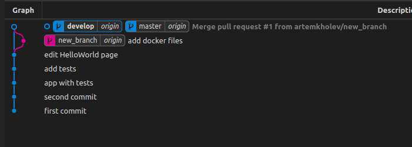

# Модель ветвления для Git

Все действи будут происходить над проектом, котрый находиться в репозитории

[https://github.com/artemkholev/appDev](https://github.com/artemkholev/appDev)

Мы считаем ветку origin/master главной.  Ветвь origin/develop мы считаем главной ветвью для разработки.

Создадим, старую смержим и удалим.



Когда исходный код в ветви разработки (develop) достигает стабильного состояния и готов к релизу, все изменения должны быть определённым способом влиты в главную ветвь (master)

По мимо master и develop для проекта нужно использовать её 3 ветки для оптимизации процесса рзработки.

- Ветви функциональностей (Feature branches)
- Ветви релизов (Release branches)
- Ветви исправлений (Hotfix branches)

Feature branches 


Создали новую ветку от develop, можно приступить к разработке фичи.


Добавил новый функционал. Завершённая функциональность (фича) вливается обратно в ветвь разработки (develop) и попадает в следующий релиз.

```jsx
git checkout develop

git merge --no-ff myfeature

git branch -d myfeature

git push origin develop
```


master не трогаем

**release branches**

Ветви релизов (release branches) используются для подготовки к выпуску новых версий продукта.

Ветвь релиза создаётся из ветви разработки (develop).

```jsx
git checkout -b release-1.2 develop

./bump-version.sh 1.2

git commit -a -m "Bumped version number to 1.2"
```


В релизную ветку добавим не большие изменения 


Когда  ветвь релиза (release branch) окончательно готова для выпуска, нужно проделать несколько действий. В первую очередь ветвь релиза вливается в главную ветвь

```jsx
git checkout master

git merge --no-ff release-1.2

git tag -a 1.2
```


```jsx
git checkout develop

git merge --no-ff release-1.2
```


Удаляем ветку релиза 

```jsx
git branch -d release-1.2
```


**hotfix branches**

Ветви для исправлений (hotfix branches) весьма похожи на ветви релизов (release branches), так как они тоже используются для подготовки новых выпусков продукта, разве лишь незапланированных.

Ветви исправлений (hotfix branches) создаются из главной (master) ветви.

Допустим появился баг, для этого нужно создать hotfix branch

```jsx
$ git checkout -b hotfix-1.2.1 master

$ ./bump-version.sh 1.2.1

$ git commit -a -m "Bumped version number to 1.2.1"

$ git commit -m "Fixed severe production problem"
```


Когда баг исправлен, изменения надо влить обратно в главную ветвь (master)

```jsx
git checkout master

git merge --no-ff hotfix-1.2.1

git tag -a 1.2.1
```


После нужно перенести изменения в develop

**если в данный момент существует ветвь релиза (release branch), то ветвь исправления (hotfix branch) должна вливаться в неё, а не в ветвь разработки (develop)**

```jsx
git checkout develop

git merge --no-ff hotfix-1.2.1
```


Теперь нужно удалить ветку изменений багов

```jsx
git branch -d hotfix-1.2.1
```

