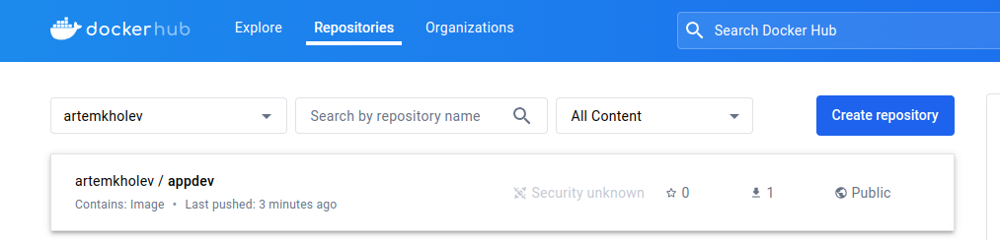

# dockerhub

В работе был создан аккаунт на docker hub, после был добавлен проект



В самом проекте пропишим 2 файла 


Docker-build-app

```jsx
FROM node:lts-alpine as build
WORKDIR /app
COPY package.json /app/package.json
RUN npm install
COPY . /app
RUN npm run build

############
### prod ###
############
FROM nginx:alpine

# copy artifact build from the 'build environment'
COPY --from=build /app/dist /usr/share/nginx/html

# expose port 80
EXPOSE 80

# run nginx
CMD ["nginx", "-g", "daemon off;"]

```

docker-compose.yml

```jsx
version: '3'
services:
    web:
        build: .
        stdin_open: true
        tty: true
        ports: 
            - "8080:8080"
        volumes:
            - "/app/node_modules" 
            - ".:/app"
```

Запустим команду для сборки образа 

```jsx
docker build -t <name> -f Dockerfile-build-app .
```

В результате получаем 


Чтобы запустить контэйнер

```jsx
docker run -itd -p 8080:80 <name>
```


Откроем страницу для проверки работоспособности


Всё работает

Зальём на dockerhub, используя команду docker push <name>

Ссылка, чтобы посмотреть [https://hub.docker.com/u/artemkholev](https://hub.docker.com/u/artemkholev)