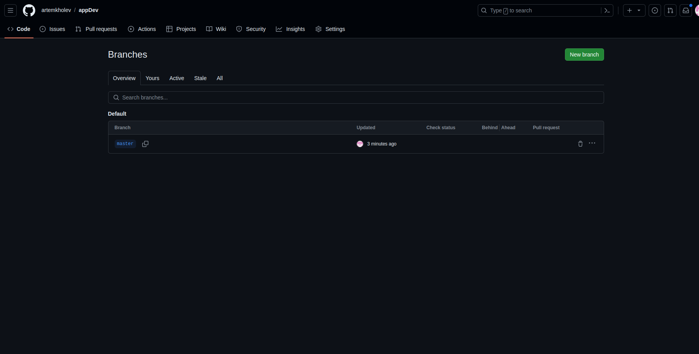

# Создание ветки

Действия производились с проектом, который находится в репозитории.

[https://github.com/artemkholev/appDev](https://github.com/artemkholev/appDev)

В данном проекте есть одна ветка мастер, создадим ещё 1, назовем её new_branch

