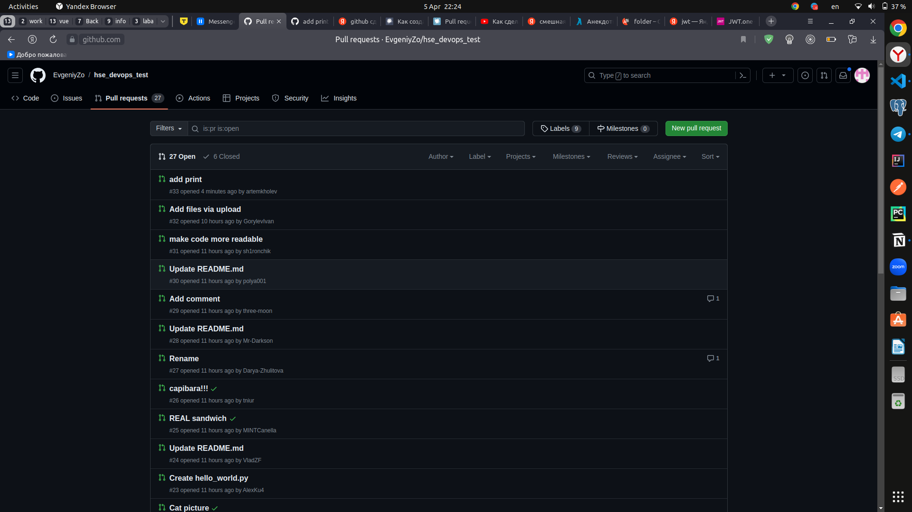

# git pull request

В данной работе проверяется умение делать pull request.

В результате был клонирован репозиторий, можно посмотреть 
https://github.com/artemkholev/hse_devops_test

После в проект быди внесены изменения, отправлен pull request

