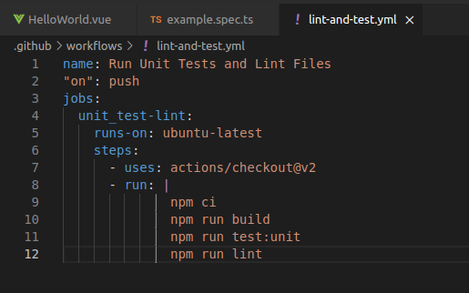

# Тесты

В данной работе был создан репозиторий с небольшим проектом, в котором в github actions были применены автоматические тесты, для frontend vue.js.

Тестовый проект можно посмотерть в моём репозитории, был создан проект appDev - [https://github.com/artemkholev/appDev](https://github.com/artemkholev/appDev/actions)

В проекте прописал 

Cделал коммит 

Прошёл успешно 

Исправим код, допустим ошибку и сделаем ещё коммит

Тестируется

Тесты были не пройдены(

